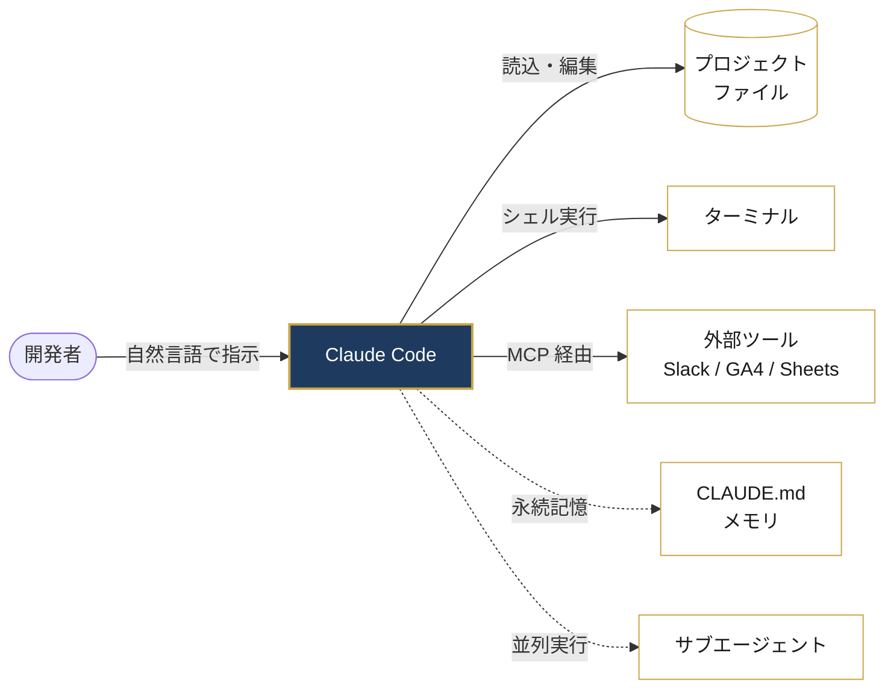
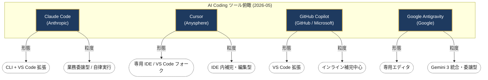

import Conclusion from '../../components/article/Conclusion.astro';
import SectionPoint from '../../components/article/SectionPoint.astro';
import FactBadge from '../../components/article/FactBadge.astro';
import OriginalAnalysis from '../../components/article/OriginalAnalysis.astro';
import CitationCaption from '../../components/article/CitationCaption.astro';
import ComparisonTable from '../../components/article/ComparisonTable.astro';
import FAQ from '../../components/article/FAQ.astro';
import ExtLink from '../../components/article/ExtLink.astro';

<figure class="article-hero">
  
</figure>

<Conclusion variant="lead">
**この記事の結論**

- **Claude Code は PC のファイルを直接読み書きする agentic coding tool**（Anthropic 公式定義）
- **VS Code 拡張**で導入でき、月額 **$20（約¥3,000）から**始められる
- **ターミナル未経験のマーケターでも 1 日でメディアを構築できた**実体験あり
- Cursor / GitHub Copilot / Google Antigravity と比較すると **「業務委譲型」**が最も近い特徴

本ガイドは、Anthropic 公式ドキュメントを一次情報として、Claude Code を VS Code で使い始めるまでの手順、月額料金、主要 AI Coding ツールとの比較、そして実際に 1 日でメディアサイトを構築した経験までを網羅します。プログラミング未経験の Web マーケターやディレクター、コンサルタントが今日から触れる導入マニュアルです。
</Conclusion>

## そもそも Claude Code とは — 公式定義と直感イメージ

<SectionPoint>
Claude Code は PC のファイルを直接読み書きしコマンドを実行する agentic coding tool。ChatGPT との決定的な差はローカル統合。
</SectionPoint>

### 公式定義（Anthropic からの引用）

Anthropic の公式ドキュメントは Claude Code をこう定義しています。

> "Claude Code is an agentic coding tool that reads your codebase, edits files, runs commands, and integrates with your development tools. Available in your terminal, IDE, desktop app, and browser."

<CitationCaption author="Anthropic 公式ドキュメント" url="https://code.claude.com/docs/en/overview" date="2026-05-03" type="official_doc" />

要点を日本語で言い直すと、「**コードベースを読み、ファイルを編集し、コマンドを実行し、開発ツールと統合する agentic（エージェント型：AI が自律的に複数のツールやファイル操作を判断・連鎖実行する性質）なコーディング・ツール**」です。<FactBadge type="primary" />

### ターミナル未経験者向けの直感イメージ

「agentic」「コーディング・ツール」と聞くと身構えてしまいますが、マーケターやディレクターのみなさんに伝わる比喩はこうです。

**Claude Code = PC に常駐して、ファイル操作とコマンド実行を任せられる AI 秘書**

普段 ChatGPT は「ブラウザでチャットして、答えをコピペで自分の作業に使う」道具です。Claude Code は違います。「PC に住んでいて、自分のフォルダの中のファイルを読み、書き換え、必要なら黒い画面（ターミナル：PC を文字入力で操作する画面、Mac は『ターミナル.app』、Windows は『PowerShell』）でコマンドも叩いてくれる」相棒です。

<OriginalAnalysis>
ChatGPT と Claude Code の決定的な違いは「ローカルファイルを直接読み書きする」点です。<FactBadge type="analysis" />会話で完結するチャットボットと、業務ファイルに介入するエージェントでは設計思想が根本的に違います。だから本記事では「ChatGPT 強化版」ではなく「業務に介入する別カテゴリの AI」として位置づけます。
</OriginalAnalysis>

### Claude Code でできること 5 つ

公式ドキュメントから主要機能を 5 つ抜き出します。<FactBadge type="primary" />

1. **ファイル直接編集**：プロジェクトのファイルを横断的に読み、複数ファイルにまたがる修正を自律的に実行
2. **コマンド実行**：ターミナル上でテストや自動デプロイなどのコマンドを叩く
3. **MCP（Model Context Protocol：AI と外部ツールを繋ぐ標準仕様）連携**：Google Drive、Slack、Jira などを Claude Code から操作
4. **メモリ（CLAUDE.md）**：プロジェクトに永続的な指示を保存し、セッションを跨いで学習
5. **サブエージェント**：大規模タスクを分割し、複数のエージェントに並列で実行させる

<CitationCaption author="Anthropic 公式ドキュメント" url="https://code.claude.com/docs/en/overview" date="2026-05-03" type="official_doc" />

### 全体像 — Claude Code を中心とした連携イメージ

5 つの機能がどう連携するかを 1 枚の図で見ると、構造が掴みやすくなります。



中心の Claude Code に **5 つの腕**が伸びている、と捉えると関係性が頭に入ります。実線は「直接の操作」、破線は「永続化・並列化」の補助レイヤーです。

次の章では、なぜ「今」Claude Code に触れるべきなのか、業界の動きを踏まえて整理します。

---

## なぜ今 Claude Code か — 業界動向で読み解く必然性

<SectionPoint>
2026年末にAIエージェントが人間検索の88%に達する見込み。業務側の変化に合わせて手元ツールも委譲型へ。
</SectionPoint>

### AI Search Tipping Point — エージェント=人間検索の 88%

検索マーケティング分析の BrightEdge は 2026 年 4 月、「AI 検索はティッピングポイントに達し、2026 年末までにオンライン顧客の大半が AI エージェントになる」と発表しました。<FactBadge type="primary" />

要約すると、AI エージェントによるリクエストはすでに人間検索の **88%** に相当し、Web トラフィックの約 **15%** がエージェント活動。市場機会は **$400 億**規模と試算されています。

<CitationCaption author="BrightEdge / GlobeNewswire" url="https://www.globenewswire.com/news-release/2026/04/08/3270159/0/en/brightedge-data-ai-search-is-reaching-a-tipping-point-by-end-of-2026-most-online-customers-will-be-ai-agents.html" date="2026-04-08" type="press_release" />

### ChatGPT が「目的地」から「Web の入口」へ

Semrush が 2026 年 4 月に公開したクリックストリーム 17 ヶ月分の分析では、ChatGPT 経由の外部リファラルが **+206%** 成長。ChatGPT は「会話で完結する目的地」から「開かれた Web への入口」へ機能を変化させています。<FactBadge type="primary" />

<CitationCaption author="Semrush（Luke Harsel）" url="https://www.semrush.com/blog/chatgpt-search-insights/" date="2026-04-07" type="web_article" />

### GA4 × AI × MCP で従来 2-5 時間が大幅短縮

業界の実務化も進んでいます。Web担当者Forum が 2026 年 1 月に公開した HAPPY ANALYTICS 小川卓氏監修の解説では、GA4 × 生成 AI × MCP の組み合わせで「従来 2-5 時間かかっていた作業が大幅に短縮、MCP の設定は 30 分から 1 時間で済む」と紹介されています。

> 「MCPサーバーを使えば、日本語で生成AIに質問するだけで、GA4から必要なデータを取得し、分析結果を文章・グラフ・表で返してくれます。」

<CitationCaption author="深谷 歩 / HAPPY ANALYTICS 小川 卓 監修" url="https://webtan.impress.co.jp/e/2026/01/08/51802" date="2026-01-08" type="web_article" />

<OriginalAnalysis>
3 つの数字が示すのはひとつの方向性です。<FactBadge type="analysis" />**業務側（顧客接触チャネル）が AI エージェント前提に組み替わるなら、手元の作業ツールもエージェント駆動に切り替えるのが自然な進化**です。GA4 のような分析環境がすでに「日本語で質問するだけ」になっている以上、文章作成や運用作業が「自分で書いてコピペ」のままでは作業速度の差が広がる一方です。Claude Code はこの動きの最右翼に位置します。
</OriginalAnalysis>

---

## Claude Code 導入方法 — VS Code 連携を前提にしたステップバイステップ

<SectionPoint>
Mac/Windows/Linux 共通の手順を 5 ステップで解説。所要時間は 30 分〜1 時間です。
</SectionPoint>

### Step 0 — 必要要件と前提知識

公式ドキュメントによる必要要件は以下のとおりです。<FactBadge type="primary" />

- **OS**：macOS 13.0 以降 / Windows 10 1809 以降 / Ubuntu 20.04 以降 / Debian 10 以降 / Alpine Linux 3.19 以降
- **メモリ**：4GB 以上の RAM
- **プロセッサ**：x64 または ARM64
- **ネットワーク**：インターネット接続必須
- **シェル**（コマンドを実行する環境）：Bash / Zsh / PowerShell / CMD（Windows では Git Bash 推奨）

<CitationCaption author="Anthropic 公式ドキュメント" url="https://code.claude.com/docs/en/setup" date="2026-05-03" type="official_doc" />

### Step 1 — ターミナルを開く

ターミナルは「PC を文字入力で操作する画面」です。普段は触らなくても、Claude Code をインストールするときだけ 1 回開きます。

- **Mac の場合**：「アプリケーション」→「ユーティリティ」→「ターミナル.app」
- **Windows の場合**：スタートメニューで「PowerShell」と入力して起動
- **Linux の場合**：標準の端末アプリ（GNOME Terminal など）

黒い画面に文字を打ち込むだけです。怖く見えますが、コピペで対応できます。

### Step 2 — Claude Code をインストール

Anthropic 公式が用意するインストーラを 1 行のコマンドで叩きます。OS 別にコピペしてください。<FactBadge type="primary" />

**macOS / Linux / WSL**：

```bash
curl -fsSL https://claude.ai/install.sh | bash
```

**Windows（PowerShell）**：

```powershell
irm https://claude.ai/install.ps1 | iex
```

**Homebrew 利用者**：

```bash
brew install --cask claude-code
```

**npm（Node.js 18 以降が必須）**：

```bash
npm install -g @anthropic-ai/claude-code
```

<CitationCaption author="Anthropic 公式ドキュメント" url="https://code.claude.com/docs/en/setup" date="2026-05-03" type="official_doc" />

### Step 3 — VS Code 拡張をインストール

VS Code（Visual Studio Code：Microsoft の無料コードエディタ）を入れていない方は、まず <ExtLink href="https://code.visualstudio.com/">VS Code 公式サイト</ExtLink> からダウンロード・インストールします。

その後、VS Code を開き、左側のメニューにある「拡張機能（Extensions）」アイコンをクリック。検索ボックスに「Claude Code」と入力して、Anthropic 公式の拡張をインストールします。

<OriginalAnalysis>
Claude Code はターミナル CLI 単体でも動きますが、私が VS Code 連携を強く推す理由は 2 つあります。<FactBadge type="analysis" />ひとつは「拡張インストールの手数が最小」で、ターミナル未経験者でも GUI 操作だけで導入が完結すること。もうひとつは「将来 Cursor 等の VS Code フォーク IDE に乗り換えたくなったときに、設定の互換性が保たれること」です。最初の選択は IDE 中立で進めておくと後悔が少ないです。
</OriginalAnalysis>

### Step 4 — 初回認証フロー

ターミナルまたは VS Code から `claude` と打つと、Anthropic アカウントとの認証フローが起動します。ブラウザが開き、ログイン後にコードを入力するだけです。

ここで重要な注意点があります。<FactBadge type="analysis" />

<OriginalAnalysis>
**Claude Code が表示する Allow プロンプト（操作許可確認）で、安易に「Yes-all-project」を選んではいけません**。一度全許可にすると、悪意ある外部コンテンツを取り込んだ瞬間にプロンプトインジェクション（AI に偽の指示を混入させる攻撃）の起点になります。私自身、運用初期に全許可リスト 295 件を全部削除してリセットした経験があります。最初は「Yes」「No」を毎回判断する負荷がありますが、これがセキュリティの肝です。
</OriginalAnalysis>

### Step 5 — 最初の「Hello, Claude」を打つ

認証が通ったら、簡単な質問を投げてみます。ターミナル上では、たとえばこのようなやり取りになります。

<figure>
  
</figure>

これだけで Claude Code は実際にファイルを作り、内容を書き込みます。**自然言語の指示が、PC への実際の操作になる**——この瞬間が Claude Code の本質です。

---

## 料金プランの選び方 — マーケターには Pro $20/月（約¥3,000）が現実的

<SectionPoint>
Pro/Max/Team/Enterprise の 4 プラン。個人なら Pro 即決、複数人なら Team を検討。
</SectionPoint>

### プラン早見表（2026-05 時点）

公式 pricing ページから整理しました。<FactBadge type="primary" />全プランに Claude Code の利用が含まれます。

<ComparisonTable
  caption="Anthropic Claude プラン比較（2026-05 時点・記事公開時に再確認）"
  headers={["プラン", "月額", "対象", "Claude Code 利用"]}
  rows={[
    ["Free", "$0", "個人・お試し用", "なし（Web のみ・制限あり）"],
    ["Pro", "$20（約¥3,000）", "個人・標準利用", "含む（Sonnet + Opus アクセス）"],
    ["Max", "$100〜（約¥15,000〜）", "個人・ヘビーユース", "含む（5x〜20x 以上の使用量）"],
    ["Team", "$20〜100/席", "5-150 人組織", "含む（SSO・中央請求対応）"],
    ["Enterprise", "カスタム見積", "大規模組織", "含む（SCIM・監査ログ・HIPAA 対応）"]
  ]}
/>

<CitationCaption author="Anthropic" url="https://claude.com/pricing" date="2026-05-03" type="official_doc" />

### マーケターに最適なプラン選定

ターミナル未経験のマーケター・ディレクター・コンサルタントの場合、**まずは Claude Pro（$20/月、約¥3,000/月）からの入会**で十分です。月の利用上限は普段使いには十分余裕があり、後から Max にアップグレードもできます。

3-5 人規模のチームで使うなら Team プラン（$20-100/席）。SSO（シングルサインオン）や中央請求が必要になる規模感です。

### API 課金との関係

ややこしいのが「Claude Pro/Max に含まれる利用」と「Anthropic API 直接利用」の違いです。Pro/Max のサブスクは Claude Code 込みの定額。一方で API を直接使う場合は別途トークン単位の課金（Sonnet で input $3 / output $15 per MTok など）が発生します。<FactBadge type="primary" />

<CitationCaption author="Anthropic" url="https://claude.com/pricing" date="2026-05-03" type="official_doc" />

最初の 1-2 ヶ月は Pro の定額で慣れて、月の API 推定コストが Pro 月額を超えるようなら Max への切り替えを検討する流れが現実的です。

---

## 他 AI Coding ツール比較 — Cursor / GitHub Copilot / Antigravity

<SectionPoint>
「支援」vs「委譲」が選定の核。IDE 内補完なら Cursor/Copilot、業務委譲なら Claude Code。
</SectionPoint>

### 比較対象 4 ツールの選定理由

AI Coding ツールは多数ありますが、ターミナル未経験のマーケター視点で意思決定に効く 4 ツールに絞ります。

- **Claude Code**（Anthropic）— 本記事の主役
- **Cursor**（Anysphere）— VS Code フォーク IDE、知名度高い
- **GitHub Copilot**（Microsoft）— 一般認知トップ
- **Google Antigravity**（Google）— 2025 年 11 月発表の新興、Gemini 3 統合

OpenAI Codex CLI と OSS 系（Cline / Aider）は補足の段落で扱います。

### 4 ツールの位置付けマップ — 「支援」vs「委譲」軸

文章で並べてもピンと来づらいので、**「使い方の形態（IDE 内 / 拡張 / CLI）」と「依頼粒度（補完 / 編集 / 委譲）」**の 2 軸で位置を整理します。



ざっくり言えば、**「IDE の中で書く手を AI に支えてもらいたい」なら Cursor / Copilot**、**「業務タスクを丸ごと AI に任せたい」なら Claude Code / Antigravity** です。本記事では業務委譲型としての Claude Code を主役に据えています。

### Claude Code vs Cursor vs Copilot vs Antigravity

<ComparisonTable
  caption="Claude Code / Cursor / GitHub Copilot / Google Antigravity の機能比較（2026-05 時点）"
  headers={["項目", "Claude Code", "Cursor", "GitHub Copilot", "Google Antigravity"]}
  rows={[
    ["提供元", "Anthropic", "Anysphere", "GitHub (Microsoft)", "Google"],
    ["動作環境", "ターミナル / VS Code拡張 / JetBrains / デスクトップ / ブラウザ / iOS", "専用 IDE（VS Code フォーク）", "VS Code / JetBrains プラグイン", "専用 IDE（VS Code フォーク系）"],
    ["自然言語駆動", "◯（agentic）", "◯（Composer/Agent）", "◯（Chat/Agent）", "◯（agentic、Manager Surface）"],
    ["主要モデル", "Claude Sonnet/Opus/Haiku", "複数モデル切替（Claude/GPT 等）", "OpenAI 系 + GitHub Models", "Gemini 3 Pro/Flash + Claude/GPT-OSS"],
    ["MCP 対応", "◯（公式）", "未確認", "未確認", "未確認"],
    ["サブエージェント", "◯（公式 sub-agents）", "未確認", "未確認", "◯（Manager Surface）"],
    ["永続メモリ", "◯（CLAUDE.md）", "◯（.cursorrules）", "未確認", "未確認"],
    ["料金（個人）", "Pro $20/月〜（約¥3,000）", "$20/月〜（要再確認）", "$10/月〜（要再確認）", "Public preview 中・個人無料"],
    ["ターミナル必須度", "中（CLI 主、IDE 補助）", "低（GUI 主）", "低（IDE 内）", "低（GUI 主）"],
    ["非エンジニア学習コスト", "中", "低", "中", "低"]
  ]}
/>

<CitationCaption author="各社公式ドキュメント（Anthropic / Anysphere / GitHub / Google）" url="https://code.claude.com/docs/en/overview" date="2026-05-03" type="official_doc" />

Google Antigravity は <ExtLink href="https://developers.googleblog.com/build-with-google-antigravity-our-new-agentic-development-platform/">Google Developers Blog の発表記事</ExtLink>によると、2025 年 11 月 18 日に Gemini 3 と同時にローンチされた agentic development platform です。Editor View（IDE）と Manager Surface（複数エージェント並列管理）の 2 モードで動作し、Anthropic の Claude Sonnet 4.5 や OpenAI の GPT-OSS にもモデル切替できる柔軟性があります。

### OSS 系と OpenAI Codex CLI の位置付け

メイン比較表外の補足です。

- **OpenAI Codex CLI**：OpenAI の CLI 型 AI コーディングツール。Claude Code と最も直接的に競合する存在ですが、仕様は進化中で「未確認」セルが多くなるため詳細比較は避けました。記事公開直前の最新仕様確認を推奨。
- **Cline / Aider**（OSS 系）：BYOK（Bring Your Own Key：自分の API キーを持参）型の OSS。上級者向けで、ターミナル未経験のマーケターには学習コストが見合いません。

### マーケター視点での選び方

<OriginalAnalysis>
**「コードを書く支援」と「業務を任せる委譲」の根本的な差**で住み分けるのが分かりやすいです。<FactBadge type="analysis" />

- **IDE の中でコード補完が欲しい** → Cursor / GitHub Copilot
- **業務（記事制作・データ分析・レポート生成）を AI に委譲したい** → Claude Code
- **Gemini エコシステム前提で IDE 統合まで一気に欲しい** → Antigravity

私自身は SEO/LLMO 分析・記事制作・議事録という業務委譲が主目的なので Claude Code を選んでいます。「コードを書きたい」のではなく「業務を AI に任せたい」マーケターには、Claude Code が現状ベストフィットです。
</OriginalAnalysis>

<OriginalAnalysis>
比較表で「未確認」セルを残したことには理由があります。<FactBadge type="analysis" />Cursor / Copilot / Antigravity の MCP 対応・サブエージェント対応は、各社公式情報が断片的で、記事執筆時点では断定できません。**推測で埋めずに「未確認」と明示すること**は、ハルシネーション（AI が事実でない情報を確定情報のように出力する現象）防止の設計思想として重要です。読者にとっては不便ですが、嘘を書くより誠実です。
</OriginalAnalysis>

---

## 実業務への適用事例 — skills 17 / agents 9 体の運用知見

<SectionPoint>
SEO/LLMO 分析・レポート・記事制作・議事録・勤怠まで、19 業務を Claude Code で自動化中。
</SectionPoint>

### 規模感

私（imperial.sakas.work 運営者）の Claude Code 運用環境は、**スキル 17 種・エージェント 9 体・ナレッジ約 35 件・メモリ約 100 件**を組み合わせた構成です。<FactBadge type="analysis" />

- **スキル**：スラッシュコマンド（`/article-write-draft` など）でユーザーが起動するワークフロー。Claude が手順を実行
- **エージェント**：自律反復・長時間監視・自動判断ループ。記事制作の commander は 9 体並列階層
- **ナレッジ**：再利用可能なノウハウ・設計パターン
- **メモリ**：プロジェクト固有のフィードバック・参照履歴

### 業務カテゴリ別マップ

19 業務の内訳です。

<ComparisonTable
  caption="Claude Code で自動化中の業務カテゴリ（imperial-sakas 運用環境、2026-05 時点）"
  headers={["カテゴリ", "具体的な自動化内容", "スキル数"]}
  rows={[
    ["SEO/LLMO 分析", "AI 概要の出現有無検出、引用分析、複数 LLM 応答比較", "4"],
    ["レポート制作・スプシ生成", "勤怠請求書 自動生成、プロンプト別詳細 CSV→スプシ、CRO 横断分析", "6"],
    ["記事制作・デプロイ", "SERP 分析→構成→初稿チェック、Cloudflare Pages 自動デプロイ", "4"],
    ["議事録・勤務管理", "Tactiq/Fireflies → 議事録自動生成、勤怠抽出", "3"],
    ["モニタリング・トレンド", "LLM 応答品質モニタリング、Google AIO 更新追跡", "2"]
  ]}
/>

### skills と agents の使い分け

ターミナル未経験者がよく迷うポイントを整理します。<FactBadge type="analysis" />

- **skills/**：スラッシュコマンド（`/foo`）でユーザーが起動する。手順型ワークフロー。レポート生成、ブラウザ UI 起動、分析フローなど
- **agents/**：自律反復・自動判断ループ。長時間監視、複数エージェント並列協調

「手順が決まっている定型業務」は skills、「状況判断と分岐が必要な仕事」は agents、と覚えると近いです。

<OriginalAnalysis>
**「ペルソナ・参照ナレッジ・learning の三位一体運用」**が、私が回した運用設計の核です。<FactBadge type="analysis" />

各エージェントに以下 3 層を持たせます。

1. **ペルソナ**：エージェントの役割・判断スタイル・トーン
2. **参照ナレッジ**：起動冒頭で必ず読む共通規約・既存ナレッジファイル
3. **learning**：実行履歴を蓄積し、次回起動時に自動参照

mtg-minutes-tactiq（議事録自動生成）で実証されたのは、**「学習の蓄積で精度が継続的に向上する」**こと。最初の 5 回は手動修正が必要でも、20 回目には学習機能で参加者判定とカテゴリ分類が自動化される——この後付けでは難しい構造を、各エージェントの初期設計から組み込んでおくのがコツです。
</OriginalAnalysis>

<OriginalAnalysis>
クライアント案件で運用するときに重要な設計が、**knowledge/ の三層分離**です。<FactBadge type="analysis" />

- `knowledge/clients/`：クライアント固有情報（**外部出力禁止**）
- `knowledge/website/`：Web 制作系（SEO/LLMO 別系統）
- `knowledge/`（ルート）：再利用可能パターン集約

クライアント名を含む情報は記事化したり外部レポートに混入させたりしないルールを、ファイルパスのレベルで強制します。私自身、配布パッケージで他人の Claude Code 環境にスキルを移植する運用も行っていますが、その場合も OAuth 優先・共有アカウント revoke 禁止・差分配布キット運用などのルールで安全側に倒しています。
</OriginalAnalysis>

---

## 1 日で組めた実例 — imperial-sakas メディア構築体験談

<SectionPoint>
朝〜夕方の時系列で、空サイト公開〜自動デプロイ稼働までの実体験を公開。
</SectionPoint>

このメディア（imperial.sakas.work）自体が、Claude Code を使って 1 日で組み立てた成果物です。時系列で追います。<FactBadge type="analysis" />

### 朝 — Astro v6 プロジェクト初期化

`npm create astro@latest` を打って、Astro v6（静的サイトジェネレータ）の最小テンプレートでプロジェクトを生成。Cloudflare adapter / sitemap / mdx を `astro add` で追加。所要 10 分。

### 午前 — GitHub リポ作成・初回 push

`gh` CLI を使って `mimic-labo/imperial-sakas-site` を public リポとして作成し、初回 push。`.gitignore` の調整含めて 30 分。

### 昼 — Cloudflare Pages 接続と「dist/client」トラップ

Cloudflare ダッシュボードから GitHub と Pages プロジェクトを連携。**ここでひとつ詰まりました**。Astro v6 + Cloudflare adapter の組合せで `output: 'static'` 指定でも実態は `mode: 'server'` 扱いになり、ビルド出力は `dist/client/` と `dist/server/` に分かれます。Cloudflare Pages の Build output directory を初期値 `dist` のままにしていたため、最初のデプロイでは `pages.dev` 直アクセスで 404 が返りました。

<OriginalAnalysis>
ここで Claude Code の真価を見ました。<FactBadge type="analysis" />私が「`pages.dev` で 404 になる」と伝えたら、Claude Code がローカルの `dist/` 構造を `ls -la` で確認し、「HTML は `dist/client/` 配下にある。Cloudflare Pages の Build output directory を `dist` から `dist/client` に変更すれば解決」と即時診断。原因特定から修正までを、私が VS Code を見ているだけで完了させました。**ターミナル操作と原因特定の両方を agentic に委譲できる**——これがチャットボット型 AI とエージェント型 AI の決定的な違いです。
</OriginalAnalysis>

### 午後 — Value Domain CNAME と Cloudflare Custom domain・SSL

ドメインは Value Domain で運用していたため、CNAME レコードを Value Domain 側で `imperial → imperial-sakas-site.pages.dev.` で追加。Cloudflare Pages 側の Custom domains 登録（My DNS provider モード）で Verify ボタンを押し、SSL 証明書が自動発行されるまで数分待機。これで `imperial.sakas.work` が公開状態になりました。

### 夕方 — agents/ 9 体雛形・learning/ 配置

将来の記事制作パイプラインに向けて、`agents/imperial-sakas-commander` + 8 体のサブエージェント（research-scout、fact-checker、writer など）の CLAUDE.md 雛形と learning/README.md を一気に配置。Git 連携の再接続後、push したコミットで Cloudflare Pages の自動ビルドがトリガーされることも検証完了。

### Before / After

定量データはまだ集計中ですが、感覚値の Before/After はこんな具合です。<FactBadge type="unverified" />

- **Before**：サイト構築を依頼すれば 2-3 週間、自分でやるなら手探りで 1 週間以上
- **After**：1 日で空サイト公開〜自動デプロイ稼働まで完了

正確な時間短縮率は今後の運用で計測予定です。

---

## つまずきポイントと設計判断のコツ

<SectionPoint>
Allow プロンプト・MCP 認証・SSR 必須の 3 点が初期に最も詰まる箇所です。
</SectionPoint>

### Allow プロンプトポリシー

すでに導入手順の章でも触れましたが、改めて強調します。**Allow プロンプトで「Yes-all-project」を選ばない**。これは私の運用ポリシーで、過去に全許可リスト 295 件を全部リセットした実体験から来ています。<FactBadge type="analysis" />

WebSearch・新規 WebFetch・`python -c '*'` 系のコマンドは特に永続化候補にしません。プロンプトインジェクション攻撃の引き金になり得るからです。

### MCP 認証方式の選定

MCP（Model Context Protocol）で外部ツール（GA4、Slack、Sheets 等）を Claude Code に繋ぐ場合、認証方式の選び方が重要です。<FactBadge type="primary" />

<CitationCaption author="Anthropic 公式ドキュメント" url="https://code.claude.com/docs/en/mcp" date="2026-05-03" type="official_doc" />

<OriginalAnalysis>
私は MCP 認証で **OAuth ADC（Application Default Credentials）authorized_user 方式**を採用しています。<FactBadge type="analysis" />クライアント所有の GA4 プロパティでは、サービスアカウント方式が使えないケースが多く、ADC authorized_user で逃げる必要があるからです。OAuth は Slack・GSC・Sheets でも共通化でき、運用が単純になります。
</OriginalAnalysis>

### AI クローラは JS 非実行 → SSR/SSG 必須

メディアサイトを運営するマーケターには重要な知見です。

> 「主要 AI エージェント（GPTBot, ClaudeBot, PerplexityBot 等）はリソース効率とコスト観点から JavaScript を実行せず、生 HTML のみを解析する」

<CitationCaption author="白浜泰友 / 令和トラベル CTO" url="https://engineering.reiwatravel.co.jp/blog/Advent-Calendar-20251208" date="2025-12-08" type="web_article" />

<OriginalAnalysis>
この知見が、imperial.sakas.work に Astro（SSG：静的サイトジェネレータ）を選んだ理由です。<FactBadge type="analysis" />CSR（クライアントサイドレンダリング）型サイトは AI クローラに「コンテンツがない」と判定されかねません。Astro なら SSG が標準で、Cloudflare Pages との親和性も最高。AI 時代の Web 媒体は、**コンテンツを生 HTML で配信できる構造**が前提になります。
</OriginalAnalysis>

---

## FAQ — よくある質問

<FAQ items={[
  { q: "Claude Code は ChatGPT と何が違いますか？", a: "ChatGPT がブラウザで会話するのに対し、Claude Code はあなたの PC のファイルを直接読み書きしコマンドを実行する agentic coding tool です（公式 overview より）。" },
  { q: "プログラミングできなくても使えますか？", a: "自然言語で指示できるので可能です。本記事の運用例（マーケターが 1 日で imperial.sakas.work メディアを構築）が一例です。" },
  { q: "月額いくらかかりますか？", a: "Claude Pro は $20/月（約 ¥3,000）、Max は $100/月〜（約¥15,000〜）。Pro / Max 共に Claude Code 込みです。為替変動と料金改定があり得るため、契約直前に公式 pricing ページで最新値を確認してください。" },
  { q: "VS Code でしか使えませんか？", a: "VS Code 拡張のほか、ターミナル CLI / JetBrains / デスクトップ / ブラウザ / iOS でも動きます。本記事は最も需要が高い VS Code 連携を主軸に解説しました。" },
  { q: "データは Anthropic に送られますか？", a: "プロンプトと応答はモデル処理のため送信されます。機密情報の扱いは Anthropic 公式プライバシーポリシーを必ず参照してください（最新仕様は要確認）。" },
  { q: "既存の Cursor / GitHub Copilot から乗り換えるべきですか？", a: "用途次第です。IDE 内コード補完なら Cursor / Copilot、業務自動化と委譲なら Claude Code、Gemini 中心なら Antigravity。並行検証 1-2 週間が現実的です。" },
  { q: "オフラインで使えますか？", a: "使えません。クラウド API への接続が必須です。" }
]} />

---

## 結論再掲 — マーケターでも今日から触れる

<Conclusion variant="summary">
ここまで Anthropic 公式ドキュメントを一次情報として、Claude Code を VS Code で使い始めるまでの手順、月額料金、Cursor / GitHub Copilot / Google Antigravity との比較、そして imperial.sakas.work メディアを 1 日で構築した実体験を整理してきました。

**ターミナル未経験のマーケター・ディレクター・コンサルタントでも、月 $20（約¥3,000）から、VS Code 拡張で導入し、まずは「Hello, Claude」を打つところから始められます**。Allow プロンプトの判断ポリシーや MCP 認証方式など、私が運用で得た知見も合わせて参考にしてください。

次の記事では「**Claude Code セットアップ詳細・フォルダ構造・スキル/エージェント設計**」を扱う予定です。`skills` と `agents` の使い分け基準、`CLAUDE.md` メモリ機能の活用パターン、そして安全側に倒した運用ポリシー設計を、より具体的に解説します。
</Conclusion>
